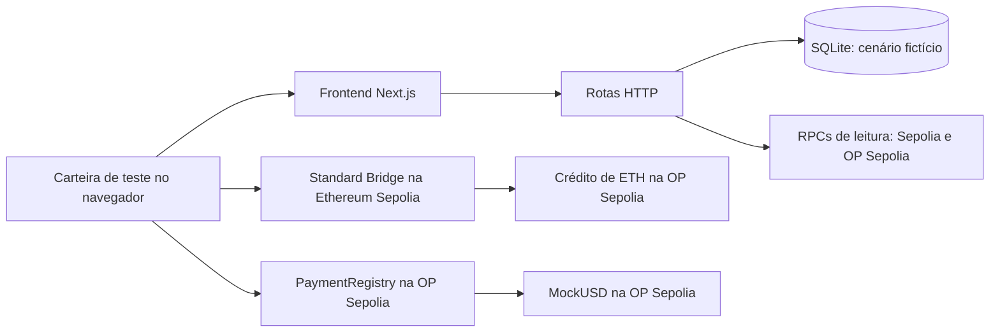

# Orquestrador de pagamentos internacionais para PMEs, com liquidação demonstrativa em Optimism

> Projeto de portfólio, inteiramente em testnet. Não recebe dinheiro real, dados bancários ou chaves privadas.

O aplicativo demonstra um **cenário fictício** de pagamento B2B: calcula uma cotação fixa a partir de um valor em BRL, registra a aprovação comercial, acompanha um depósito de ETH de teste da Ethereum Sepolia para a OP Sepolia e conduz a liquidação de `MockUSD` de teste na OP Sepolia. A conversão monetária e o pagamento bancário ao fornecedor são apenas representações na interface. O depósito de ETH e a transferência de `MockUSD` são transações independentes; o token não é bridged.

## Estado comprovado do repositório

| Componente | Estado |
| --- | --- |
| Frontend responsivo em português, carteira injetada, cotação, progresso e links de explorador | Implementado; testado localmente |
| Backend HTTP, cotação determinística e persistência SQLite de cenários fictícios | Implementado; testado localmente |
| Verificação de recibos, eventos e estado na Ethereum Sepolia e OP Sepolia | Implementada; testada com respostas de RPC controladas |
| `MockUSD` e `PaymentRegistry` | Implementados, compilados e testados em rede local Hardhat |
| Testes unitários e de integração locais | Implementados: 19 do modelo compartilhado, 109 do web/backend e 18 dos contratos |
| Teste de navegador da jornada completa | Implementado e aprovado com carteira, RPC e API simulados |
| Deploy dos contratos na OP Sepolia | **Confirmado** por recibos públicos, bytecode e leituras dos contratos em `11155420` |
| Código-fonte dos contratos | **Correspondência exata** de criação e execução no Sourcify; fontes importados e marcados como verificados no Blockscout |
| Depósito L1 → L2 e jornada manual de pagamento | **Pendente**; os testes locais e de navegador usam respostas controladas |

Os testes de navegador exercitam a integração da interface com respostas controladas. Eles não comprovam depósito ou pagamento público. O formulário e a cotação podem ser executados localmente sem endereços de contratos; as ações de carteira exigem configuração e tokens de teste.

### Contratos públicos para inspeção

Os contratos abaixo foram implantados em **5 de outubro de 2026**, na **OP Sepolia (`11155420`)**, pela carteira de teste `0x90f10aD923cc949b1F000134702452821b44bef6`. Os dois recibos têm status de sucesso. O registro aponta para o token informado e o token tem `6` casas decimais. [Evidências completas](docs/deployment-evidence.md).

| Contrato | Endereço e código verificado | Transação de implantação | Bloco |
| --- | --- | --- | --- |
| `MockUSD` | [`0x0202d5f1D5427BcA9d3aD546832B0D82fcd7aD92`](https://sourcify.dev/server/repo-ui/11155420/0x0202d5f1D5427BcA9d3aD546832B0D82fcd7aD92) | [`0x32ed67b1…eb515`](https://optimism-sepolia.blockscout.com/tx/0x32ed67b19cd3cc04c8e563af0fa89ea1ff6340f7906203fae916ffa3580eb515) | `49702386` |
| `PaymentRegistry` | [`0xEB8642297c98206502e8fc05f659e5a2b12b051c`](https://sourcify.dev/server/repo-ui/11155420/0xEB8642297c98206502e8fc05f659e5a2b12b051c) | [`0x1cc0244f…96321`](https://optimism-sepolia.blockscout.com/tx/0x1cc0244fadb409b9b47cd3f6786f0acb3e7c5fc24a35780f7018f5c5c0596321) | `49702393` |

Esse deploy confirma apenas os contratos. **Não há ainda hash de depósito na Ethereum Sepolia, crédito correspondente na OP Sepolia, mint de demonstração, pagamento liquidado ou saldo de beneficiário comprovado.**

## O que o MVP implementa

1. Formulário mínimo que representa uma fatura fictícia com carteira pagadora, carteira beneficiária e valor fictício em BRL. Não há número, texto, arquivo ou identificação real de fatura.
2. Cotação fixa de `R$ 5,0000` por `MockUSD` e tarifa fictícia de `1%`, calculadas no servidor com aritmética inteira.
3. Aprovação comercial explícita, separada das assinaturas da carteira.
4. Depósito de `0,0001` ETH de teste pelo Standard Bridge na Ethereum Sepolia e verificação separada do crédito na OP Sepolia.
5. Criação, aprovação e liquidação de uma operação no `PaymentRegistry`; `MockUSD.approve` limita a autorização ao valor exato e ao contrato do registro.
6. Verificação no backend de rede, recibo, evento, argumentos e estado antes de avançar; exibição de hash, chain ID, bloco, status e explorador.
7. Conclusão visual de payout local fictício somente depois da liquidação confirmada na L2.

| Rede | Papel | Chain ID |
| --- | --- | --- |
| Ethereum Sepolia | Origem do depósito de ETH de teste | `11155111` |
| OP Sepolia | Crédito do depósito e liquidação de `MockUSD` | `11155420` |

`MockUSD` é um ERC-20 de demonstração com seis casas decimais. **Não é USDC, dólar ou stablecoin e não possui valor monetário.** O emissor de teste precisa distribuir o token à carteira pagadora após um eventual deploy. O aplicativo não faz mint automático.

## Como as partes se conectam



A carteira assina cada escrita; o backend **não** assina transações. O backend registra hashes enviados e só avança os estados on-chain após verificar recibos, eventos e leituras independentes. O SQLite contém dados e identificadores fictícios, não uma fatura real. Consulte [docs/design.md](docs/design.md) para o modelo de estados.

## Executar localmente

Requisitos: Node.js `22.13.0+`, pnpm `11.18.0` e uma carteira EIP-1193 injetada para ações on-chain. Para começar de um checkout novo:

```bash
git clone https://github.com/LelloTereciani/projeto-integrador-OptmismWeb3.git
cd projeto-integrador-OptmismWeb3
pnpm install --frozen-lockfile
cp apps/web/.env.example apps/web/.env.local
```

O frontend e as rotas do backend rodam no mesmo processo Next.js. O SQLite é criado automaticamente em `apps/web/payment-demo.sqlite`, ou no caminho definido por `PAYMENT_DB_PATH`. O arquivo é ignorado pelo Git. RPCs públicos de teste têm valores padrão e podem ser substituídos em `apps/web/.env.local`.

As duas variáveis `NEXT_PUBLIC_*_ADDRESS` vêm vazias no exemplo para que cada pessoa escolha entre inspecionar o deploy público acima ou fazer seu próprio deploy. Para apontar o app aos contratos públicos, preencha `apps/web/.env.local` com:

```dotenv
NEXT_PUBLIC_MOCK_USD_ADDRESS=0x0202d5f1D5427BcA9d3aD546832B0D82fcd7aD92
NEXT_PUBLIC_PAYMENT_REGISTRY_ADDRESS=0xEB8642297c98206502e8fc05f659e5a2b12b051c
```

Depois de salvar `apps/web/.env.local`, inicie o servidor na raiz do repositório:

```bash
pnpm --filter @payment-demo/web exec next dev --hostname 127.0.0.1 --port 3000
```

Abra **[http://127.0.0.1:3000](http://127.0.0.1:3000)** no navegador que contém sua carteira injetada, como MetaMask. Mantenha o terminal aberto; `Ctrl+C` encerra o servidor. Se mudar `NEXT_PUBLIC_*_ADDRESS`, reinicie o servidor. Essa URL funciona na própria máquina e não significa que a aplicação web esteja hospedada publicamente. **Nunca coloque chave privada em `apps/web/.env.local` ou em uma variável `NEXT_PUBLIC_`**. A chave de deploy/mint pertence apenas ao cofre local do Hardhat ou a um ambiente privado ignorado pelo Git.

## Verificação local

```bash
pnpm test
pnpm typecheck
pnpm build
pnpm --filter @payment-demo/contracts lint
pnpm --filter @payment-demo/web lint
pnpm --filter @payment-demo/web db:check
pnpm --filter @payment-demo/web test:e2e
```

`pnpm test` inclui testes de domínio, rotas, SQLite, recibos/eventos, estados de carteira e contratos na rede Hardhat simulada. `test:e2e` usa Playwright/Chromium e mocks determinísticos de carteira, RPC e API; na primeira execução, instale o navegador com `pnpm --filter @payment-demo/web exec playwright install chromium`. Nenhum teste envia fundos ou transações para testnets públicas.

## Executar e comprovar a jornada pública

Os contratos listados acima já estão na OP Sepolia. Para uma demonstração completa, use duas carteiras **de teste** diferentes: a pagadora assina as transações e a beneficiária recebe `MockUSD`. A pagadora precisa de ETH de teste na **Ethereum Sepolia** para o depósito de `0,0001 ETH` e o gas, além de ETH de teste na **OP Sepolia** para as ações de contrato. Consulte os [faucets listados pela Optimism](https://docs.optimism.io/app-developers/tools-sdks/faucets) e confira os saldos atuais antes de começar. A carteira de deploy `0x90f10aD923cc949b1F000134702452821b44bef6` é a única que pode emitir o `MockUSD` público; se você não a controla, implante seus próprios contratos seguindo a seção seguinte ou solicite tokens de teste ao emissor.

Se você controla a carteira emissora configurada no cofre local do Hardhat, distribua tokens à **mesma carteira pagadora** que usará no navegador. Substitua `0xCARTEIRA_PAGADORA` pelo endereço completo; `50` é apenas uma quantidade de exemplo, que deve cobrir a cotação escolhida. O comando pede a senha do cofre no terminal e envia uma transação de teste na OP Sepolia:

```bash
MOCK_USD_ADDRESS=0x0202d5f1D5427BcA9d3aD546832B0D82fcd7aD92 MOCK_USD_RECIPIENT=0xCARTEIRA_PAGADORA MOCK_USD_AMOUNT=50 pnpm --filter @payment-demo/contracts exec hardhat run scripts/mint-demo-token.ts --network opSepolia --build-profile production --no-typechain
```

No [app local](http://127.0.0.1:3000), siga esta sequência. Revise sempre a rede, o destinatário, o contrato e o valor apresentados antes de confirmar cada assinatura na carteira:

1. Clique em **Conectar carteira**. Informe a conta conectada em **Carteira pagadora de teste**, outra conta em **Carteira beneficiária de teste** e, por exemplo, `100,00` no valor fictício em BRL. Clique em **Gerar cotação simulada** e **Aprovar cenário fictício**.
2. Na **Ethereum Sepolia (`11155111`)**, clique em **Depositar ETH de teste** e confirme `0,0001 ETH` mais gas na carteira. Guarde o hash L1. Aguarde o recibo L1 e use **Verificar crédito na OP Sepolia** até o backend confirmar a execução correspondente na L2. Não envie um segundo depósito enquanto o primeiro estiver pendente.
3. Na **OP Sepolia (`11155420`)**, siga as ações exibidas: **Criar operação na OP Sepolia**, **Aprovar operação fictícia**, **Aprovar valor exato de MockUSD** e **Liquidar MockUSD de teste**. Cada escrita exige confirmação explícita na carteira e depois é conferida pelo backend.
4. Após a liquidação confirmada, clique em **Exibir payout local simulado**. Esse último estado não representa conversão ou transferência bancária real.

Guarde o **ID do cenário** e mantenha a aba aberta: o SQLite conserva o cenário, mas esta versão da interface não o reabre automaticamente após recarregar a página. Em **Evidências on-chain do cenário**, copie os hashes, chain IDs, blocos, status e links dos exploradores. Para comprovar a demonstração, confira no explorador o depósito L1, o crédito L2 vinculado a ele, o mint, os eventos `PaymentCreated`, `PaymentApproved` e `PaymentSettled`, a aprovação exata do token e o saldo final de `MockUSD` da beneficiária. Registre somente o que foi confirmado publicamente em [docs/deployment-evidence.md](docs/deployment-evidence.md) e atualize a tabela de estado deste README. O depósito L1, por si só, não comprova o crédito L2. Os [depósitos do OP Stack](https://docs.optimism.io/op-stack/bridging/deposit-flow) explicam essa distinção.

## Implantar seus próprios contratos na OP Sepolia

Use **somente uma carteira dedicada a testnet**, com ETH de teste suficiente para as duas redes. O contrato `MockUSD` existe apenas na OP Sepolia. Para abastecer a carteira, consulte os [faucets listados pela Optimism](https://docs.optimism.io/app-developers/tools-sdks/faucets). A implantação é opcional para estudar o código e executar os testes locais; ela envia transações públicas de teste.

1. Configure `OP_SEPOLIA_RPC_URL` e `OP_SEPOLIA_PRIVATE_KEY` no cofre do Hardhat. Na primeira utilização, crie e guarde a senha do cofre; nas seguintes, digite essa mesma senha no terminal. Ela não tem valor padrão e não pode ser recuperada a partir do repositório. Os comandos solicitam os valores de modo interativo; **não** escreva a chave no comando, no repositório ou em mensagens:

   ```bash
   pnpm --filter @payment-demo/contracts exec hardhat keystore set OP_SEPOLIA_RPC_URL
   pnpm --filter @payment-demo/contracts exec hardhat keystore set OP_SEPOLIA_PRIVATE_KEY
   ```

2. Rode os testes, confira a rede `11155420` e implante o módulo Ignition. O Hardhat pedirá a senha do cofre no terminal:

   ```bash
   pnpm --filter @payment-demo/contracts test
   pnpm --filter @payment-demo/contracts exec hardhat build --build-profile production --no-typechain
   pnpm --filter @payment-demo/contracts exec hardhat ignition deploy ignition/modules/PaymentDemo.ts --network opSepolia --build-profile production --no-typechain
   ```

3. Confira `contracts/ignition/deployments/chain-11155420/deployed_addresses.json`, os recibos, o bytecode e os links dos exploradores. Registre os resultados em [docs/deployment-evidence.md](docs/deployment-evidence.md). O comando de deploy, por si só, não prova confirmação ou verificação de código-fonte. Para verificar **seus** contratos no Sourcify, substitua os valores abaixo pelos endereços e pela carteira emissora do seu deploy:

   ```bash
   pnpm --filter @payment-demo/contracts exec hardhat verify sourcify --network opSepolia --build-profile production --no-typechain ENDERECO_MOCK_USD CARTEIRA_EMISSORA
   pnpm --filter @payment-demo/contracts exec hardhat verify sourcify --network opSepolia --build-profile production --no-typechain ENDERECO_PAYMENT_REGISTRY ENDERECO_MOCK_USD
   ```

   A [verificação direta no Blockscout hospedado](https://docs.blockscout.com/devs/verification/hardhat-verification-plugin) requer uma chave da API Pro do Blockscout. O Sourcify permite conferir a correspondência do código sem essa chave; o Blockscout pode importar os fontes verificados depois, como ocorreu com os contratos públicos deste projeto.
4. Copie **somente** os dois endereços públicos de contratos para `apps/web/.env.local` como `NEXT_PUBLIC_MOCK_USD_ADDRESS` e `NEXT_PUBLIC_PAYMENT_REGISTRY_ADDRESS`; reinicie o app.
5. Distribua `MockUSD` de teste à carteira pagadora com o emissor configurado no deploy. Substitua os três valores públicos abaixo pelos dados da sua demonstração. `MOCK_USD_AMOUNT` está em unidades legíveis do token, que possui seis casas decimais:

   ```bash
   MOCK_USD_ADDRESS=0x... MOCK_USD_RECIPIENT=0x... MOCK_USD_AMOUNT=50 pnpm --filter @payment-demo/contracts exec hardhat run scripts/mint-demo-token.ts --network opSepolia --build-profile production --no-typechain
   ```

6. Atualize `apps/web/.env.local` com os endereços da sua implantação, reinicie o servidor e siga a seção **Executar e comprovar a jornada pública** com suas carteiras de teste.

Os [depósitos do OP Stack](https://docs.optimism.io/op-stack/bridging/deposit-flow) têm uma transação de origem na L1 e uma execução derivada na L2. O recibo L1 sozinho não comprova crédito L2. A aplicação exige essa separação antes de liberar o pagamento. A [referência de rede da Optimism](https://docs.optimism.io/op-mainnet/network-information/connecting-to-op) contém os dados atuais da OP Sepolia.

### Problemas frequentes

| Sintoma | Verifique |
| --- | --- |
| Cotação funciona, mas transação mostra configuração ausente | Endereços `NEXT_PUBLIC_*_ADDRESS` no arquivo `apps/web/.env.local`; reinicie o servidor. |
| Carteira pede outra rede | Depósito usa Ethereum Sepolia `11155111`; registro e liquidação usam OP Sepolia `11155420`. |
| Depósito L1 confirmado, ação L2 ainda bloqueada | Aguarde e atualize a verificação do crédito na OP Sepolia; são recibos diferentes. |
| Liquidação informa saldo ou allowance insuficiente | Confirme mint de `MockUSD` ao pagador e aprovação exata para `PaymentRegistry`. |
| Banco ou câmbio não aparece no explorador | Essas etapas são fictícias e existem apenas na aplicação. |
| Hardhat pede senha do keystore | Use a senha criada ao configurar o cofre; não é a senha da carteira nem existe uma senha padrão no projeto. |

## Limites explícitos

- Não há transferência de reais ou dólares, câmbio de mercado, banco, payout real, fornecedor real, KYC/KYB/AML ou documentos.
- Não há autenticação de usuário, custódia, assinatura automática, relayer, WalletConnect, saque L2 → L1, bridge de `MockUSD` ou suporte a outros rollups.
- O SQLite local guarda somente o cenário fictício e referências públicas de transações. Este MVP não oferece gestão multiusuário nem proteção operacional para dados financeiros reais.
- A interface mantém o cenário ativo apenas na aba atual; recarregar a página não restaura automaticamente uma jornada já gravada no SQLite.
- O contrato não faz swap, conversão ou pagamento internacional. Ele registra e transfere o token de teste entre carteiras na OP Sepolia.
- O projeto usa a rede Optimism; não opera um sequencer, batcher nem constrói um rollup próprio.

A lista detalhada do que entra e do que fica fora está em [docs/mvp-scope.md](docs/mvp-scope.md). A arquitetura e os estados estão em [docs/design.md](docs/design.md), a interface em [docs/frontend.md](docs/frontend.md) e as tarefas e pendências em [docs/implementation-plan.md](docs/implementation-plan.md). [docs/deployment-evidence.md](docs/deployment-evidence.md) separa o deploy confirmado da jornada manual ainda pendente.

## Evolução para produção — conhecimento arquitetural, fora do MVP

Um produto financeiro real exigiria parceiros autorizados para entrada de recursos, câmbio e payout, conciliação, KYC/KYB/AML, privacidade e controles regulatórios. Para autorizações programáveis, a assinatura manual poderia evoluir para smart accounts com políticas de valor máximo, prazo, beneficiários permitidos, nonce, revogação e múltiplas aprovações corporativas. Isso exige decisão explícita sobre custódia, gestão de chaves, auditoria independente dos contratos, monitoramento, resposta a incidentes e testes de segurança e operação adequados.

Essas capacidades são **propostas de evolução**: não estão implementadas, testadas nem disponíveis neste repositório. Veja [docs/production-evolution.md](docs/production-evolution.md).
