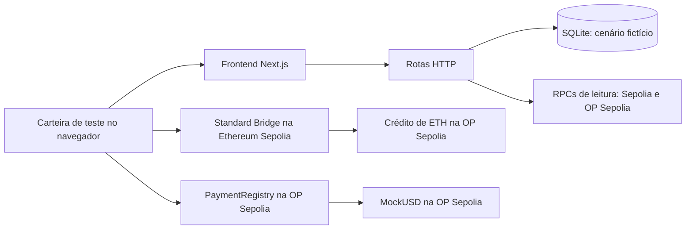

# Orquestrador de pagamentos internacionais para PMEs, com liquidação demonstrativa em Optimism

> Projeto de portfólio, inteiramente em testnet. Não recebe dinheiro real, dados bancários ou chaves privadas.

O aplicativo demonstra um **cenário fictício** de pagamento B2B: calcula uma cotação fixa a partir de um valor em BRL, registra a aprovação comercial e conduz a liquidação de `MockUSD` de teste na OP Sepolia. Quando a pagadora já tem ETH e MUSD na OP Sepolia, o pagamento usa esse saldo diretamente. Um depósito de ETH de teste da Ethereum Sepolia para a OP Sepolia permanece disponível como demonstração opcional da bridge. A conversão monetária e o pagamento bancário ao fornecedor são apenas representações na interface. O depósito de ETH e a transferência de `MockUSD` são transações independentes; o token não é bridged.

## Estado comprovado do repositório

| Componente | Estado |
| --- | --- |
| Frontend responsivo em português, carteira injetada, cotação, progresso e links de explorador | Implementado; testado localmente |
| Backend HTTP, cotação determinística e persistência SQLite de cenários fictícios | Implementado; testado localmente |
| Verificação de recibos, eventos e estado na Ethereum Sepolia e OP Sepolia | Implementada; testada localmente e usada para confirmar o depósito público L1 → L2 |
| `MockUSD` e `PaymentRegistry` | Implementados, compilados e testados em rede local Hardhat |
| Testes unitários e de integração locais | **155 aprovados**: 19 do modelo compartilhado, 118 do web/backend e 18 dos contratos |
| Testes de navegador | **5 aprovados** com carteira, RPC e API simulados, incluindo pagamento direto, aviso de saldo insuficiente e recuperação de uma etapa desatualizada |
| Deploy dos contratos na OP Sepolia | **Confirmado** por recibos públicos, bytecode e leituras dos contratos em `11155420` |
| Código-fonte dos contratos | **Correspondência exata** de criação e execução no Sourcify; fontes importados e marcados como verificados no Blockscout |
| Depósito Ethereum Sepolia → OP Sepolia | **Confirmado** por recibos públicos e `sourceHash` derivado do evento L1 |
| Mint de `MockUSD` | **Confirmado** na OP Sepolia: `19,8 MockUSD` para a carteira pagadora |
| Jornada manual de pagamento em `MockUSD` | **Confirmada** na OP Sepolia; `19,8 MUSD` transferidos à carteira beneficiária, com recibo, evento e estado do contrato |
| Checagem prévia automática do saldo de `MockUSD` | Implementada na cotação, na preparação com saldo L2 e antes de criar ou liquidar uma operação ou enviar um depósito opcional |
| Pagamento público da Account 4 para a Account 1 e volta | **Ainda não confirmado**; a interface e os testes locais preparam a jornada, mas cada direção exige assinaturas explícitas na MetaMask e recibo `PaymentSettled` público |

Os testes de navegador exercitam a integração da interface com respostas controladas; a prova da jornada pública está nos recibos e leituras on-chain abaixo. O formulário e a cotação podem ser executados localmente sem endereços de contratos; as ações de carteira exigem configuração e tokens de teste.

### Contratos públicos para inspeção

Os contratos abaixo foram implantados em **5 de outubro de 2026**, na **OP Sepolia (`11155420`)**, pela carteira de teste `0x90f10aD923cc949b1F000134702452821b44bef6`. Os dois recibos têm status de sucesso. O registro aponta para o token informado e o token tem `6` casas decimais. [Evidências completas](docs/deployment-evidence.md).

| Contrato | Endereço e código verificado | Transação de implantação | Bloco |
| --- | --- | --- | --- |
| `MockUSD` | [`0x0202d5f1D5427BcA9d3aD546832B0D82fcd7aD92`](https://sourcify.dev/server/repo-ui/11155420/0x0202d5f1D5427BcA9d3aD546832B0D82fcd7aD92) | [`0x32ed67b1…eb515`](https://optimism-sepolia.blockscout.com/tx/0x32ed67b19cd3cc04c8e563af0fa89ea1ff6340f7906203fae916ffa3580eb515) | `49702386` |
| `PaymentRegistry` | [`0xEB8642297c98206502e8fc05f659e5a2b12b051c`](https://sourcify.dev/server/repo-ui/11155420/0xEB8642297c98206502e8fc05f659e5a2b12b051c) | [`0x1cc0244f…96321`](https://optimism-sepolia.blockscout.com/tx/0x1cc0244fadb409b9b47cd3f6786f0acb3e7c5fc24a35780f7018f5c5c0596321) | `49702393` |

O depósito de `0,0001 ETH` de teste da carteira pagadora foi confirmado na [Ethereum Sepolia, bloco `11849996`](https://sepolia.etherscan.io/tx/0x21de2edb71dc4bc35a7d512f1f84c9bbfbeddc03a36e9baa98c2a9e02d721427), e a transação derivada teve sucesso na [OP Sepolia, bloco `49707865`](https://sepolia-optimism.etherscan.io/tx/0x71e4f147ed1d0da1100109254a2751c78f614fc3df8cde2a064008aec46f5462). O [mint de `19,8 MockUSD` no bloco `49708788`](https://sepolia-optimism.etherscan.io/tx/0x3229002993252d68e0757ab9623180c279cce69d1eebaa139c7d83e3086c3804) abasteceu a carteira pagadora. Em um cenário posterior, outro [depósito L1](https://sepolia.etherscan.io/tx/0x979ed2fff46fea8d3b3a57425e0bb3f9648236eac981be32ef3eb89d5fb57636) foi vinculado ao [crédito L2](https://sepolia-optimism.etherscan.io/tx/0x1426dafe7bc7b5092a6c75752bcb441c62deb369af6b511727c15d9d0d58e830); a [liquidação no bloco `49712036`](https://sepolia-optimism.etherscan.io/tx/0x5b9b16fadd4d3bebc4accb354be3545a386a572d72c8803559896122b71e2d21) transferiu os `19,8 MUSD` para `0xa84dDfBFDB0b2dD8f15284E8511C32be936ffC37`. Na leitura registrada após essa transação, havia `0 MUSD` para o pagador e `19,8 MUSD` para a beneficiária; saldos posteriores devem ser lidos novamente na rede. Os hashes, a tentativa anterior revertida e o método de verificação estão em [docs/deployment-evidence.md](docs/deployment-evidence.md).

## O que o MVP implementa

1. Formulário mínimo que representa uma fatura fictícia com carteira pagadora, carteira beneficiária e valor fictício em BRL. Não há número, texto, arquivo ou identificação real de fatura.
2. Cotação fixa de `R$ 5,0000` por `MockUSD` e tarifa fictícia de `1%`, calculadas no servidor com aritmética inteira.
3. Aprovação comercial explícita, separada das assinaturas da carteira.
4. Checagem de saldo na OP Sepolia para pagar diretamente ou depósito **opcional** de `0,0001` ETH de teste pelo Standard Bridge na Ethereum Sepolia, com verificação separada do crédito na OP Sepolia.
5. Criação, aprovação e liquidação de uma operação no `PaymentRegistry`; `MockUSD.approve` limita a autorização ao valor exato e ao contrato do registro.
6. Verificação no backend de rede, recibo, evento, argumentos e estado antes de avançar; exibição de hash, chain ID, bloco, status e explorador.
7. Conclusão visual de payout local fictício somente depois da liquidação confirmada na L2, leitura dos saldos de MUSD e opção de adicionar o token à MetaMask.

| Rede | Papel | Chain ID |
| --- | --- | --- |
| Ethereum Sepolia | Origem do depósito de ETH de teste | `11155111` |
| OP Sepolia | Crédito do depósito e liquidação de `MockUSD` | `11155420` |

`MockUSD` é um ERC-20 de demonstração com seis casas decimais. **Não é USDC, dólar ou stablecoin e não possui valor monetário.** O emissor de teste precisa distribuir o token à carteira pagadora após um eventual deploy. O aplicativo não faz mint automático.

**Para que servem ETH e MUSD nesta demonstração:** o ETH de teste mostra o depósito da L1 para a L2 e pode pagar gas na OP Sepolia; ele não é trocado por MUSD. O MUSD é emitido separadamente na OP Sepolia e é o ativo fictício efetivamente transferido da pagadora à beneficiária. Depois do recebimento, ele fica na carteira beneficiária e pode ser visto ou transferido como token de teste, mas o MVP não oferece resgate, conversão em moeda local nem payout bancário.

## Como as partes se conectam



A carteira assina cada escrita; o backend **não** assina transações. O backend registra hashes enviados e só avança os estados on-chain após verificar recibos, eventos e leituras independentes. O SQLite contém dados e identificadores fictícios, não uma fatura real. Consulte [docs/design.md](docs/design.md) para o modelo de estados.

## Executar localmente

Requisitos: Node.js `22.13.0+`, pnpm `11.18.0` e uma carteira EIP-1193 injetada para ações on-chain. Para começar de um checkout novo:

```bash
git clone https://github.com/LelloTereciani/projeto-integrador-OptmismWeb3.git
cd projeto-integrador-OptmismWeb3
pnpm install --frozen-lockfile
cp apps/web/.env.example apps/web/.env.local
```

O frontend e as rotas do backend rodam no mesmo processo Next.js. O SQLite é criado automaticamente em `apps/web/payment-demo.sqlite`, ou no caminho definido por `PAYMENT_DB_PATH`. O arquivo é ignorado pelo Git. RPCs públicos de teste têm valores padrão e podem ser substituídos em `apps/web/.env.local`.

As duas variáveis `NEXT_PUBLIC_*_ADDRESS` vêm vazias no exemplo para que cada pessoa escolha entre inspecionar o deploy público acima ou fazer seu próprio deploy. Para apontar o app aos contratos públicos, preencha `apps/web/.env.local` com:

```dotenv
NEXT_PUBLIC_MOCK_USD_ADDRESS=0x0202d5f1D5427BcA9d3aD546832B0D82fcd7aD92
NEXT_PUBLIC_PAYMENT_REGISTRY_ADDRESS=0xEB8642297c98206502e8fc05f659e5a2b12b051c
```

Depois de salvar `apps/web/.env.local`, inicie o servidor na raiz do repositório:

```bash
pnpm --filter @payment-demo/web exec next dev --hostname 127.0.0.1 --port 3000
```

Abra **[http://127.0.0.1:3000](http://127.0.0.1:3000)** no navegador que contém sua carteira injetada, como MetaMask. Mantenha o terminal aberto; `Ctrl+C` encerra o servidor. Se mudar `NEXT_PUBLIC_*_ADDRESS`, reinicie o servidor. Essa URL funciona na própria máquina e não significa que a aplicação web esteja hospedada publicamente. **Nunca coloque chave privada em `apps/web/.env.local` ou em uma variável `NEXT_PUBLIC_`**. A chave de deploy/mint pertence apenas ao cofre local do Hardhat ou a um ambiente privado ignorado pelo Git.

## Verificação local

```bash
pnpm test
pnpm typecheck
pnpm build
pnpm --filter @payment-demo/contracts lint
pnpm --filter @payment-demo/web lint
pnpm --filter @payment-demo/web db:check
pnpm --filter @payment-demo/web test:e2e
```

`pnpm test` inclui testes de domínio, rotas, SQLite, recibos/eventos, estados de carteira e contratos na rede Hardhat simulada. `test:e2e` usa Playwright/Chromium e mocks determinísticos de carteira, RPC e API; na primeira execução, instale o navegador com `pnpm --filter @payment-demo/web exec playwright install chromium`. Nenhum teste envia fundos ou transações para testnets públicas.

## Executar e comprovar a jornada pública

**Prepare as carteiras e os saldos antes de iniciar o cenário.** Os contratos listados acima já estão na OP Sepolia. Use duas carteiras **de teste** diferentes: a pagadora assina as transações e a beneficiária recebe `MockUSD`. A pagadora precisa de ETH de teste na **OP Sepolia** para gas e `MockUSD` suficiente nessa rede para a cotação. ETH na **Ethereum Sepolia** só é necessário se escolher a demonstração opcional de depósito L1 → L2. Consulte os [faucets listados pela Optimism](https://docs.optimism.io/app-developers/tools-sdks/faucets) e confira os saldos atuais antes de começar. **Os faucets de ETH usados para gas não distribuem este `MockUSD` criado pelo projeto.** A carteira de deploy `0x90f10aD923cc949b1F000134702452821b44bef6` é a única que pode emitir o `MockUSD` público; se você não a controla, implante seus próprios contratos seguindo a seção seguinte ou solicite tokens de teste ao emissor.

Se você controla a carteira emissora configurada no cofre local do Hardhat, distribua tokens à **mesma carteira pagadora** que usará no navegador. Faça isso antes da demonstração, quando já houver ETH na OP Sepolia para o gas do mint. Se ainda faltar ETH nessa rede, obtenha-o primeiro pelo faucet ou por um depósito L1 → L2. Substitua `0xCARTEIRA_PAGADORA` pelo endereço completo; `50` é apenas uma quantidade de exemplo, que deve cobrir a cotação escolhida. O comando pede a senha do cofre no terminal e envia uma transação de teste na OP Sepolia:

```bash
MOCK_USD_ADDRESS=0x0202d5f1D5427BcA9d3aD546832B0D82fcd7aD92 MOCK_USD_RECIPIENT=0xCARTEIRA_PAGADORA MOCK_USD_AMOUNT=50 pnpm --filter @payment-demo/contracts exec hardhat run scripts/mint-demo-token.ts --network opSepolia --build-profile production --no-typechain
```

Confirme o recibo do mint e o saldo de `MockUSD` da pagadora na OP Sepolia antes de iniciar o fluxo no app. O mint é uma preparação feita pelo emissor: não é parte do depósito de ETH, não converte ETH em `MockUSD` e não paga a beneficiária. A interface lê `balanceOf` e exibe o saldo insuficiente para a cotação; o servidor também confere os saldos antes de habilitar o caminho direto da L2. O depósito L1 → L2 é uma demonstração opcional do OP Stack; o contrato de pagamento em si opera somente na L2 e não depende economicamente desse depósito.

No [app local](http://127.0.0.1:3000), siga esta sequência. **O valor escolhido não define o sucesso da demonstração:** use qualquer cotação positiva coberta pelo saldo de MUSD da pagadora. Por exemplo, `R$ 5,00` resulta em `0,990000 MUSD` após a tarifa simulada; `R$ 25,26` resulta em `5,000000 MUSD`. Revise sempre a rede, o destinatário, o contrato e o valor apresentados antes de confirmar cada assinatura na carteira:

1. Informe a **Account 4** (`0xa84dDfBFDB0b2dD8f15284E8511C32be936ffC37`) como pagadora e a **Account 1** (`0x90f10aD923cc949b1F000134702452821b44bef6`) como beneficiária. Clique em **Gerar cotação simulada** e **Aprovar cenário fictício**. Se o valor cotado exceder o MUSD disponível na Account 4, crie outro cenário com valor menor ou obtenha mais token de teste.
2. Clique em **Conferir saldo sem abrir a carteira**. O backend lê `balanceOf` e o saldo de ETH da pagadora na OP Sepolia. Se quiser demonstrar a bridge, escolha **Demonstrar depósito L1 → L2 (opcional)**; mantenha a **Account 4** selecionada, troque a rede da MetaMask para **Ethereum Sepolia (`11155111`)**, confirme `0,0001 ETH` mais gas e use **Verificar crédito na OP Sepolia** até o backend confirmar o relay. Depois volte à **OP Sepolia (`11155420`)**. Não envie um segundo depósito enquanto o primeiro estiver pendente.
3. **Antes de cada assinatura L2, selecione a Account 4 na MetaMask e a rede OP Sepolia.** Ela deve ser a mesma carteira pagadora escrita no cenário. Siga, nessa ordem, as ações **Criar operação na OP Sepolia**, **Aprovar operação fictícia**, **Aprovar valor exato de MockUSD** e **Liquidar MockUSD de teste**. No card **Próxima ação explícita**, o botão **Revisar e abrir a carteira** fica logo abaixo do título da etapa; feche o painel da MetaMask após cada confirmação para voltar ao app. Cada etapa abre a carteira após esse clique explícito; confirme a solicitação e aguarde a verificação do backend antes de seguir para a próxima. As três primeiras etapas não transferem MUSD. **Somente a liquidação confirmada**, com evento `PaymentSettled`, altera os saldos das duas contas.
4. Clique em **Exibir resultado simulado** quando essa ação aparecer. O card de conclusão mostra o valor transferido, o link da transação e as leituras dos saldos de MUSD das duas contas na OP Sepolia. **Agora troque a MetaMask da Account 4 para a Account 1**, mantenha a rede OP Sepolia e confira o MUSD recebido em **Tokens**. Use **Mostrar MUSD na MetaMask** se o token ainda não estiver listado. Selecionar a beneficiária só muda a conta exibida na carteira: não cria uma segunda transferência. A etapa de pagamento bancário exibida no app é fictícia.
5. Para devolver o token pelo aplicativo, clique em **Criar pagamento inverso com as carteiras trocadas**. A nova fatura vem preenchida com **Account 1 como pagadora** e **Account 4 como beneficiária**; ajuste o valor se o saldo recebido não cobrir a nova cotação. **Mantenha a Account 1 selecionada na MetaMask durante as quatro assinaturas L2** e confirme que ela também possui ETH de teste na OP Sepolia para gas. Após o segundo `PaymentSettled`, selecione a **Account 4** na MetaMask para conferir o retorno. Cada direção tem seu próprio cenário, hash e histórico.

**Como distinguir avanço de transferência:** o título **Próxima ação explícita** indica o que ainda falta. Se ele mostrar **Liquidar MockUSD de teste**, a criação e as duas aprovações já passaram, mas o saldo da beneficiária ainda não deve ter mudado. Se uma transação estiver pendente, use **Atualizar confirmação sem abrir a carteira** antes de tentar outra assinatura. Para comprovar o recebimento, confira `PaymentSettled`, o evento `Transfer` do token e o saldo da beneficiária no explorador ou no card de conclusão. A MetaMask pode demorar a atualizar a exibição; ela não é a única prova do resultado.

Se a MetaMask confirmar uma etapa e o card ainda mostrar a ação anterior, **não envie a mesma transação outra vez**. O app relê o cenário do servidor ao voltar à aba e periodicamente enquanto ela está visível. Você também pode recarregar a URL `?scenario=<ID>`: o backend recupera a etapa confirmada e mostra a próxima ação. Uma transação de criação com sucesso no explorador comprova a criação da operação, não a transferência do token.

Para ver o recebimento na MetaMask, selecione a **carteira beneficiária** na rede **OP Sepolia (`11155420`)**. Se o botão **Mostrar MUSD na MetaMask** não funcionar, use **Gerenciar tokens → Adicionar token personalizado** e informe o contrato `0x0202d5f1D5427BcA9d3aD546832B0D82fcd7aD92`, símbolo `MUSD` e `6` decimais. Expanda **Tokens com saldo baixo**, se necessário. O endereço da conta selecionada deve corresponder exatamente ao beneficiário do cenário; a MetaMask mostra o saldo da conta selecionada, e a importação do token só muda sua exibição. Atualize ou reabra a MetaMask se ela ainda mostrar um saldo antigo, e compare com a leitura on-chain exibida no app.

Guarde o **ID do cenário**. Após gerar a cotação, o app coloca `?scenario=<ID>` na URL e recupera o cenário do SQLite ao abrir ou recarregar esse link. O botão **Criar outro cenário** inicia uma fatura separada; o cenário anterior continua acessível por sua URL. Isso não assina transações automaticamente. Em **Evidências on-chain do cenário**, copie os hashes, chain IDs, blocos, status e links dos exploradores. Para comprovar a demonstração, confira no explorador o mint de preparo, os eventos `PaymentCreated`, `PaymentApproved` e `PaymentSettled`, a aprovação exata do token e o saldo final de `MockUSD` da beneficiária. Se escolher a bridge opcional, confira também o depósito L1 e o crédito L2 vinculado a ele. Registre somente o que foi confirmado publicamente em [docs/deployment-evidence.md](docs/deployment-evidence.md) e atualize a tabela de estado deste README. O depósito L1, por si só, não comprova o crédito L2. Os [depósitos do OP Stack](https://docs.optimism.io/op-stack/bridging/deposit-flow) explicam essa distinção.

## Implantar seus próprios contratos na OP Sepolia

Use **somente uma carteira dedicada a testnet**, com ETH de teste suficiente para as duas redes. O contrato `MockUSD` existe apenas na OP Sepolia. Para abastecer a carteira, consulte os [faucets listados pela Optimism](https://docs.optimism.io/app-developers/tools-sdks/faucets). A implantação é opcional para estudar o código e executar os testes locais; ela envia transações públicas de teste.

1. Configure `OP_SEPOLIA_RPC_URL` e `OP_SEPOLIA_PRIVATE_KEY` no cofre do Hardhat. Na primeira utilização, crie e guarde a senha do cofre; nas seguintes, digite essa mesma senha no terminal. Ela não tem valor padrão e não pode ser recuperada a partir do repositório. Os comandos solicitam os valores de modo interativo; **não** escreva a chave no comando, no repositório ou em mensagens:

   ```bash
   pnpm --filter @payment-demo/contracts exec hardhat keystore set OP_SEPOLIA_RPC_URL
   pnpm --filter @payment-demo/contracts exec hardhat keystore set OP_SEPOLIA_PRIVATE_KEY
   ```

2. Rode os testes, confira a rede `11155420` e implante o módulo Ignition. O Hardhat pedirá a senha do cofre no terminal:

   ```bash
   pnpm --filter @payment-demo/contracts test
   pnpm --filter @payment-demo/contracts exec hardhat build --build-profile production --no-typechain
   pnpm --filter @payment-demo/contracts exec hardhat ignition deploy ignition/modules/PaymentDemo.ts --network opSepolia --build-profile production --no-typechain
   ```

3. Confira `contracts/ignition/deployments/chain-11155420/deployed_addresses.json`, os recibos, o bytecode e os links dos exploradores. Registre os resultados em [docs/deployment-evidence.md](docs/deployment-evidence.md). O comando de deploy, por si só, não prova confirmação ou verificação de código-fonte. Para verificar **seus** contratos no Sourcify, substitua os valores abaixo pelos endereços e pela carteira emissora do seu deploy:

   ```bash
   pnpm --filter @payment-demo/contracts exec hardhat verify sourcify --network opSepolia --build-profile production --no-typechain ENDERECO_MOCK_USD CARTEIRA_EMISSORA
   pnpm --filter @payment-demo/contracts exec hardhat verify sourcify --network opSepolia --build-profile production --no-typechain ENDERECO_PAYMENT_REGISTRY ENDERECO_MOCK_USD
   ```

   A [verificação direta no Blockscout hospedado](https://docs.blockscout.com/devs/verification/hardhat-verification-plugin) requer uma chave da API Pro do Blockscout. O Sourcify permite conferir a correspondência do código sem essa chave; o Blockscout pode importar os fontes verificados depois, como ocorreu com os contratos públicos deste projeto.
4. Copie **somente** os dois endereços públicos de contratos para `apps/web/.env.local` como `NEXT_PUBLIC_MOCK_USD_ADDRESS` e `NEXT_PUBLIC_PAYMENT_REGISTRY_ADDRESS`; reinicie o app.
5. Distribua `MockUSD` de teste à carteira pagadora com o emissor configurado no deploy. Substitua os três valores públicos abaixo pelos dados da sua demonstração. `MOCK_USD_AMOUNT` está em unidades legíveis do token, que possui seis casas decimais:

   ```bash
   MOCK_USD_ADDRESS=0x... MOCK_USD_RECIPIENT=0x... MOCK_USD_AMOUNT=50 pnpm --filter @payment-demo/contracts exec hardhat run scripts/mint-demo-token.ts --network opSepolia --build-profile production --no-typechain
   ```

6. Atualize `apps/web/.env.local` com os endereços da sua implantação, reinicie o servidor e siga a seção **Executar e comprovar a jornada pública** com suas carteiras de teste.

Os [depósitos do OP Stack](https://docs.optimism.io/op-stack/bridging/deposit-flow) têm uma transação de origem na L1 e uma execução derivada na L2. O recibo L1 sozinho não comprova crédito L2. Quando o depósito opcional é usado, a aplicação exige essa separação antes de liberar o pagamento. O caminho direto usa saldo L2 já existente e não apresenta prova de bridge para esse cenário. A [referência de rede da Optimism](https://docs.optimism.io/op-mainnet/network-information/connecting-to-op) contém os dados atuais da OP Sepolia.

### Problemas frequentes

| Sintoma | Verifique |
| --- | --- |
| Cotação funciona, mas transação mostra configuração ausente | Endereços `NEXT_PUBLIC_*_ADDRESS` no arquivo `apps/web/.env.local`; reinicie o servidor. |
| Carteira pede outra rede | Depósito usa Ethereum Sepolia `11155111`; registro e liquidação usam OP Sepolia `11155420`. |
| Depósito L1 reverteu e consumiu gas | Consulte o recibo: um revert consome gas de teste, mas não conclui o depósito. Use a ação de verificação do depósito para o servidor registrar a falha antes de tentar novamente. O app estima o gas da bridge e adiciona margem; confirme o limite mostrado na carteira. A primeira tentativa pública e o diagnóstico estão em [docs/deployment-evidence.md](docs/deployment-evidence.md). |
| Depósito L1 confirmado, ação L2 ainda bloqueada | Aguarde e atualize a verificação do crédito na OP Sepolia; são recibos diferentes. |
| Cotação ou criação de operação mostra MUSD insuficiente | Compare o saldo da carteira pagadora na OP Sepolia com o valor exato da cotação. `R$ 25,26` pede `5 MUSD`; `R$ 120,00` pede `23,76 MUSD`. Reduza o valor em um novo cenário ou obtenha mais token de teste. |
| MUSD não mudou na MetaMask após depósito ou operação criada | Essas etapas movimentam ETH ou registram uma intenção. Confira se `PaymentSettled` foi confirmado, selecione a beneficiária na OP Sepolia e adicione MUSD à carteira. |
| MetaMask confirmou, mas a página ainda mostra a etapa anterior | Aguarde a releitura automática ou recarregue a URL do cenário. Confira o hash antes de tentar novamente; uma criação confirmada deve levar à ação **Aprovar operação fictícia**. |
| Liquidação informa allowance insuficiente | Confirme a aprovação exata do `MockUSD` para `PaymentRegistry`. |
| Banco ou câmbio não aparece no explorador | Essas etapas são fictícias e existem apenas na aplicação. |
| Hardhat pede senha do keystore | Use a senha criada ao configurar o cofre; não é a senha da carteira nem existe uma senha padrão no projeto. |

## Limites explícitos

- Não há transferência de reais ou dólares, câmbio de mercado, banco, payout real, fornecedor real, KYC/KYB/AML ou documentos.
- Não há autenticação de usuário, custódia, assinatura automática, relayer, WalletConnect, saque L2 → L1, bridge de `MockUSD` ou suporte a outros rollups.
- O SQLite local guarda somente o cenário fictício e referências públicas de transações. Este MVP não oferece gestão multiusuário nem proteção operacional para dados financeiros reais.
- A retomada exige conhecer o ID do cenário na URL; não há lista de cenários, autenticação de usuário ou recuperação por carteira.
- A interface lê `balanceOf` e informa insuficiência antes das assinaturas, mas não emite MUSD nem garante que saldo e gas continuarão disponíveis até a inclusão da transação. A simulação e a verificação do recibo continuam necessárias.
- O contrato não faz swap, conversão ou pagamento internacional. Ele registra e transfere o token de teste entre carteiras na OP Sepolia.
- O projeto usa a rede Optimism; não opera um sequencer, batcher nem constrói um rollup próprio.

A lista detalhada do que entra e do que fica fora está em [docs/mvp-scope.md](docs/mvp-scope.md). A arquitetura e os estados estão em [docs/design.md](docs/design.md), a interface em [docs/frontend.md](docs/frontend.md) e as tarefas e pendências em [docs/implementation-plan.md](docs/implementation-plan.md). [docs/deployment-evidence.md](docs/deployment-evidence.md) documenta a jornada pública confirmada e separa o payout bancário simulado.

## Melhorias futuras e evolução para produção — conhecimento arquitetural

O MVP atual separa propositalmente as etapas técnicas em 4 assinaturas sequenciais na carteira (`createPayment` → `approvePayment` → `MockUSD.approve` → `settlePayment`) para fins de demonstração didática, segregação de responsabilidades de smart contracts e verificação independente de recibos on-chain. 

Para a evolução rumo a um produto financeiro real com experiência de usuário de nível de produção (reduzindo o fluxo para **apenas uma confirmação / um clique** e diminuindo os custos de gas em até 50%), duas rotas arquiteturais foram mapeadas:

### 1. O Caminho Moderno (a ser implementado no contrato e frontend): `Permit` (EIP-2612) + Liquidação Direta
O padrão ERC-20 tradicional exige uma transação de `approve()` prévia antes de qualquer `transferFrom()`. Stablecoins modernas (como o USDC nativo na rede Optimism) e tokens avançados implementam o padrão **EIP-2612 (`Permit`)**:
- **Assinatura off-chain sem gas:** O pagador assina uma mensagem criptográfica padronizada (EIP-712) autorizando o gasto exato. Essa assinatura ocorre instantaneamente na carteira, sem custo de gas e sem gerar uma transação on-chain individual.
- **Função combinada no contrato:** O contrato `PaymentRegistry` recebe essa assinatura junto aos parâmetros da fatura em uma única chamada atômica (`payInvoiceWithPermit`):
  1. Executa `token.permit(...)` internamente usando a assinatura recebida;
  2. Executa `token.transferFrom(...)` transferindo o valor exato à beneficiária;
  3. Emite o evento `PaymentSettled(...)` e grava o estado final.
- **Benefícios:** O usuário realiza **apenas 1 clique e 1 transação na blockchain**, com redução de ~40% a 50% nos custos de gas (eliminando as taxas base de transações separadas).

### 2. O Caminho Corporativo: Account Abstraction (ERC-4337 / EIP-5792) e Smart Accounts
Em pagamentos B2B entre PMEs, empresas não costumam utilizar carteiras EOA comuns (como MetaMask básica), mas sim **Smart Accounts** (carteiras de contrato inteligente programáveis, como Safe, Biconomy ou ZeroDev):
- **Transações em lote (*Batching* / *Multicall* atômico):** A aplicação empacota todas as instruções (`createPayment`, `approvePayment`, `token.approve`, `settlePayment`) dentro de um único pacote (*UserOperation*). O usuário confirma **apenas uma vez** e todas as etapas são executadas de forma indivisível no mesmo bloco. Se qualquer etapa falhar, toda a operação reverte com segurança.
- **Patrocínio de taxas (*Paymaster*):** A empresa operadora do serviço de pagamento pode patrocinar o gas em segundo plano ou debitar as taxas diretamente na moeda da fatura, eliminando a necessidade de o cliente final possuir ETH para gas na carteira.
- **Políticas corporativas e governança:** Permite definir limites de gastos diários, listas de beneficiários autorizados (*allowlists*), nonces por departamento e regras de múltiplas assinaturas (*multisig*) para liberação de remessas de maior valor.

| Abordagem | Confirmações | Experiência do Usuário (UX) | Cenário de Aplicação |
|---|:---:|---|---|
| **MVP Atual (Didático)** | 4 | Segregação explícita de recibos e estados on-chain | Demonstração técnica, auditoria e portfólio |
| **Caminho Moderno (`Permit` EIP-2612)** | 1 | 1 assinatura off-chain (sem gas) + 1 transação | Gateways Web3 ágeis e pagamentos em USDC |
| **Caminho Corporativo (Account Abstraction)** | 1 | 1 clique, gas patrocinado (*Paymaster*), regras de governança | Plataformas B2B empresariais e fintechs |

Além da camada de contratos, a transição para produção envolveria parceiros bancários regulados para câmbio e payout local, controles de KYC/KYB/AML, auditoria formal de segurança e políticas rigorosas de chaves. Consulte [docs/production-evolution.md](docs/production-evolution.md) para a análise detalhada.
